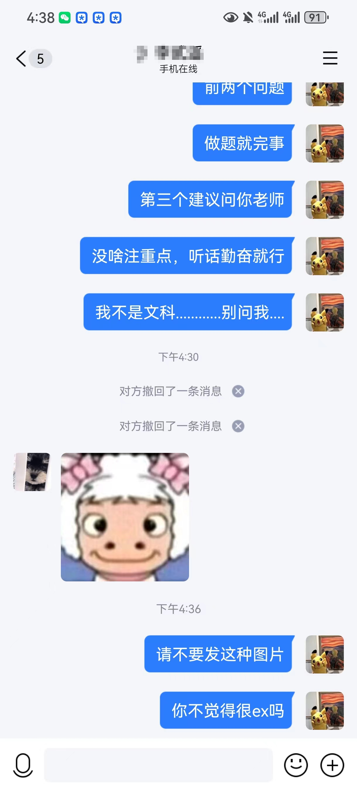
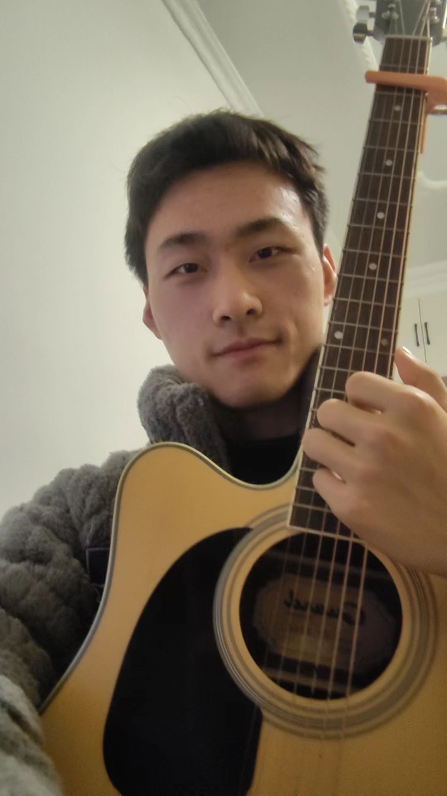

!!! abstract
    每天记录自己干了点什么，来激励，监督自己！

    每日必做：学习，健身，and可能会有吉他？

    ^(*￣(oo)￣)^

> 2024/03/01

次日回顾 :

- [ ] 快捷键

* Vscode:
  * vscode创建新窗口 ctrl + shift + n
  * F11 全屏，确保专注
  * Ctrl + K Z 圣禅模式
  * Ctrl + W 关闭该标签页
  * Alt + 1~8 切换标签页,Alt + 9 切换到最后一个标签页
  * 快速回到顶部 ： ctrl + home,快速回到底部 : ctrl + end
  * Ctrl + 右箭头,将光标移动到下一个单词的开头 
  * Ctrl + M ,数学公式
* Window:
  * window+H 笔记本的语音输入
  * window+V 剪贴板
  * window + 1,2,3 切换到对应的应用界面
* Edge:
  * Ctrl + 1~8 切换标签页,Alt+9 切换到最后一个标签页
  * Ctrl + Tab 切换到下一标签页
  * Ctrl + T 创建新标签页，Ctrl + W 关闭该标签页

- [ ] CSAPP需要补坑~

> 2024/02/25

今日目标:
1. 物理学PPT预习
2. 线代预习
3. 数分cjhppt预习 
4. 旅游日记补写

> 2024/02/21

今日比较自律，在图书馆学了很久。
打算按照图灵学习指南把欠的线代再重新复习下，跟着刘康生老师走，还是害怕学不好导致低学分的。也看了一节离散的PPT

晚上成功完成锻炼任务，分享一个视频,感觉挺好看的。

[一个算是关于的穿搭的吧](https://www.bilibili.com/list/watchlater?oid=581945276&bvid=BV1T64y1A7Fi&spm_id_from=333.1007.top_right_bar_window_view_later.content.click)

假期在家给别人辅导，发现自己在大学中也犯着同样的问题。

在过往的教育中缺乏能力的培养导致上学期是高投入低回报。下学期就勤快一点，多投入一点时间去思考总结，希望能不断将自己的学习能力提升到像兄弟们那样的水平。
下学期就要好好学了，希望能弄个保研吧。

终于大概把母校里学弟学妹的问题回答完了。也更觉得提问的智慧有多重要。

对于个人而言，你提一个问题似乎不浪费对方太多时间，但是对于接收方来说，他是要回复200多个人的，并且本来就是无义务的，只是希望母校的成绩可以更好而已。

希望大家以后共勉：

1. 提问问题时尽可能详细，说清问题背景（年级or心态or想法），说清问题关键，如果能想明白自己想要得到的回复，那也请表达出来。
2. 请在询问时更有礼貌一些
3. 请认真听当时演讲时说的呀，好多问题都是问的PPT上有的，我是真的不想回复！

在这里放一个反例！

加油吧！

> 2024/02/20

最起码下午是在图书馆学了会儿离散，智云课堂抽风了，现在看不了了，呜呜呜。(15：29)

看了两节课的离散数学，加油吧。

晚上去吃了自助小火锅，也算是吃爽啦~
> 2024/02/19

今天过的比较愉悦，虽然身体还是很累

看了飞驰人生2，也吃了上海女教师出轨的瓜

有些启发吧

首先是提高透明度，才能保证最大限度地公平，未来我也会逐步提高对我自身的透明度，来不断约束自己的不洁行为。

而是关于安分与刺激的一些思考🤔，似乎当做一些事会有背德感时，会更让人想去做，“找刺激”让人欲罢不能，本人有时也会有过这种想法和行为，不知对于这种奇怪的思想与情绪，有人有好的应对策略吗？

> 2024/02/18

非常累的一天，由于昨晚熬夜而腰酸背痛

奔波了半天，晚上确实是十分疲惫

感觉古人水土不服不是因为不适应新环境，而是在奔去新环境的路途中因为劳累过度而导致身体不舒服。
（其实这是20号的回忆...）
> 2024/02/17

昨日做了大事，看完了上学期的课本，关于博弈论的，对我有很大的题型

我发现现在的我已经不喜欢看小说，而是喜欢看这些东西。可能更加功利了？我也不知道，浅显的认知里似乎只有“功利”与“非功利”

并且受这本书启发，彻底解决了一些长久的，棘手的问题。

也算是一种彻头彻尾的改变，是一种阶段性的成熟。

希望每一段关系都是正和博弈，我的存在可以给大部分人带来愉悦

每每想认真写，分析自己，便又没有什么想法了，哎，无语。

今天上午家教完，也收获了一个大惊喜，孩子家长给了我一套衣服，确实是十分的愉悦。

下午在赶制回学校宣讲的ppt，非常的忙，晚上宣讲，现在心里已经完全不紧张了，🤭~

明天就要去学校啦，开心~

> 2024/02/16

今晚有急事，需赶制回校宣讲的PPT

明晚再写个长日记啦~

> 2024/02/14

今日略有进步

上午依旧家教

下午看了40页博弈论，晚上又练了好久好久的吉他。

不好意思放出来录的音频和视频，就放个随便拍的自拍吧~

吉他练完大约是22：00，心情很愉悦，遂打开了LOL，播放了周董的音乐

这一次玩游戏是真的很开心，刹那间似乎找到了童年的感觉

原来电子ed是因为没有边打游戏边听歌😋

唯一遗憾的就是忘记锻炼了，但总归来说还是十分开心的

除了最后晚上上床后聊天，看视频，一不小心到了凌晨一点，倍感伤心😭

> 2024/02/12

近两日疯狂玩耍

玩爽了😭

明天开始继续努力了！

> 2024/02/10

写完了年终总结~

看了半节课的CS61A

哎呀😭，我的CS61A好像学不完了，明天嘎嘎学！
> 2024/02/07

上午还是老样子，下午带着爷爷出去办了些许杂事，5点才回来。

回来路上买了一袋很好吃的东西，应该叫麻糖？（淘宝上搜到了是：老师荞麦酥特产三角酥童年的味道特产藕粉酥）

晚上嘛，今天play了约1h30min，耽搁了看回放和练吉他

嗯，以往是把游戏卸载来隔绝诱惑，现在挑战挑战自己，看看游戏就在电脑上，我能不能禁得住！🤔
> 2024/02/06

今日很自律：

上午家教3h

中午去吃了家乡美食：饸饹(╹ڡ╹ )

晚上完成了CS61A的lab08，并且弹吉他唱歌娱乐了约1h

哥哥唱歌确实很好听，以后要减少红警等视频时间，多看看歌唱艺术的回放

幸福满足的一天吧

明天提高效率！