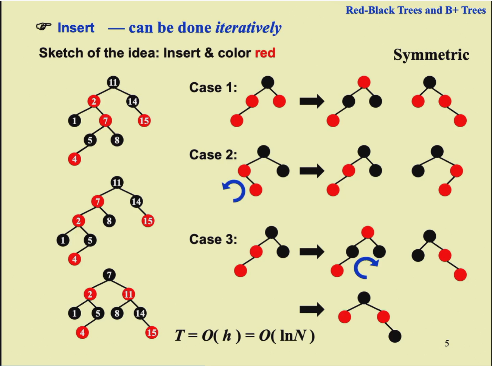
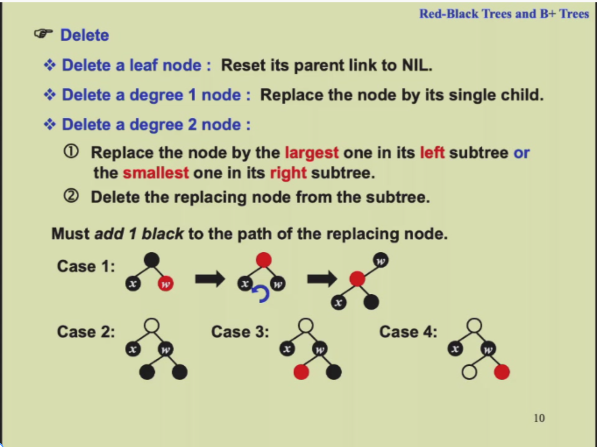
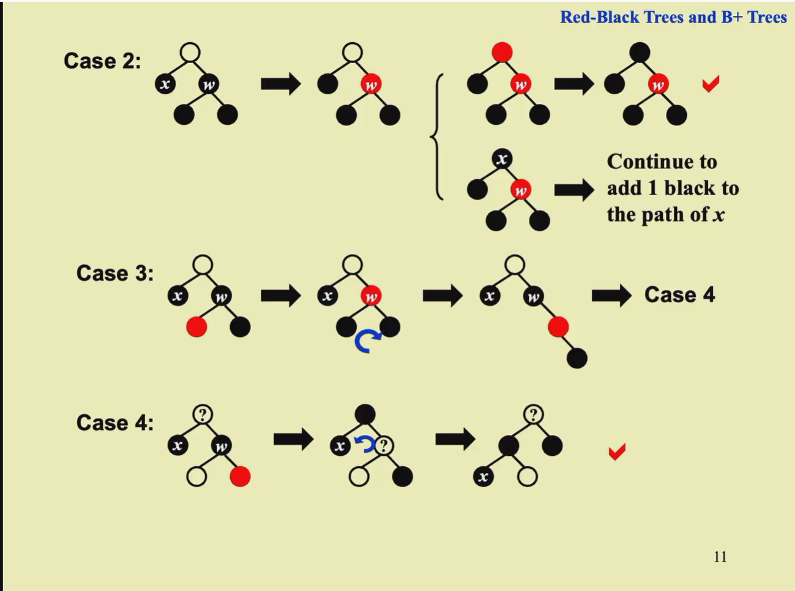

2024 / 8 / 21

## AVL Tree and Splay Tree 

* 空树的高度定义为-1

### AVL Trees
* Empty tree is height balanced. And T is height balanced iff $T_L$  and  $T_R$ is height balanced and $|h_L - h_R <= 1|$
* balance factor(BF) = $h_L - h_R$ In AVL trees, BF is either -1, 0, 1
* $n_h$ is the minimum number of nodes in a height balanced tree of height h. Then h = $O(\log n)$. So the time complexity of insertion and search is $O(\log n)$
### Splay Trees 
$T_amortized = O(\log n)$

### Amortized Analysis
* Aggregate analysis(聚合分析): a sequence of n operations takes **worst-case** time $T(n)$ in total, then the amortized time per operation is $T(n)/n$
* Accounting method(和算法):When an operation's **amortized cost** exceeds its **actual cost**, the difference is assigned to specific objects in the data structure as **credit**. This credit can be used to pay for later operations.
* Potential method(势能法): 
If $a+b <= c$ then $\log a + \log b <= 2\log c - 2$

**Theorem:** The amortized time to splay a tree with root T at node X is at most $3(R(T)-R(X))+1 = O(\log n)$ 

## Red-Black Trees and B+ Tree

### Red-Black Trees

* The black-height of a node is the number of black nodes on the path from the node to a leaf, not counting the node itself.
* A red-black tree with N internal nodes has height at most $2\log(N+1)$

#### Insert

* **Concrete process:** Case1(Iterative) -> Case2 -> Case3 ->End

#### Delete

### B+ Tree

